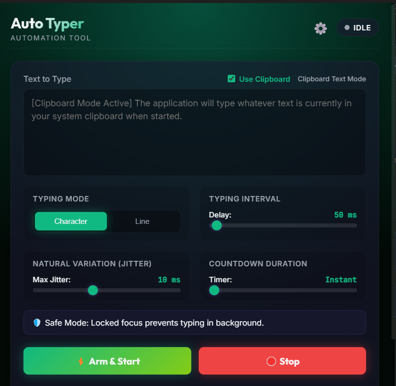

# Auto Typer



A safe, user-controlled Windows desktop automation application built on Electron, Node.js, and Windows PowerShell. It emulates physical hardware scan codes at the OS level to type text safely into other active windows.

## 🚀 Features

- **Hardware-Level Emulation**: Uses the Win32 `SendInput` API via PowerShell to simulate physical keyboard scan codes, making it compatible with applications that block standard simulated text injection.
- **Rich-Text Editor Compatibility**: Features separated KeyDown/KeyUp inputs with micro-sleep intervals, preventing skipped characters in editors like Microsoft Word.
- **Safety Target Locking**: Captures and verifies the active window handle before typing. If you focus away or switch applications, the typing process terminates instantly to protect your documents.
- **Twin-Panel Modern Interface**: A beautiful glassmorphic dark-themed UI that toggles seamlessly between the main controller and configuration screen.
- **Customizable Hotkeys**: Bind custom global shortcuts to **Arm/Start** and **Emergency Stop** typing.
- **Clipboard Mode**: Skip copy-pasting by turning on "Use Clipboard" to type whatever text is currently copied in your OS clipboard.
- **Themes & Sound**: Custom themes (Indigo Night, Sunset Crimson, Cyberpunk Gold, Forest Green) and interactive mechanical switch sound simulation.

---

## 🛠️ How It Works (Architecture)

1. **Frontend (Electron UI)**: The renderer process displays configuration options (speed, natural variation jitter, countdown timer) and manages settings state.
2. **Backend (Main Process)**: Saves user configuration inside your local app data storage (`settings.json`) and handles global shortcut registers.
3. **Engine (`typer.ps1`)**: Electron spawns a background PowerShell process executing a low-level keystroke simulator. The script checks for a temporary stop flag file (`stop.flag`) and current foreground window handles before typing each character to guarantee safe, user-driven execution.

---

## 💻 Setup & Installation

### Prerequisites
- **Operating System**: Windows 10/11 (required for Win32 API / PowerShell script runner).
- **Node.js**: Installed on your system (LTS version recommended).

### Steps to Run

1. **Clone the Repository**:
   ```bash
   git clone <your-repository-url>
   cd AutoTyper
   ```

2. **Install Dependencies**:
   ```bash
   npm install
   ```

3. **Start the Application**:
   ```bash
   npm start
   ```

---

## 🛡️ License

This project is licensed under the [MIT License](LICENSE) - see the LICENSE file for details.
